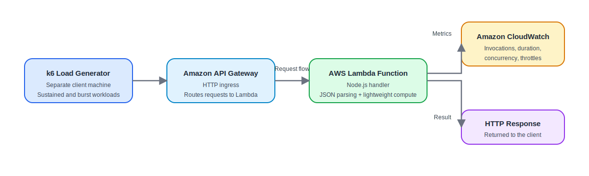
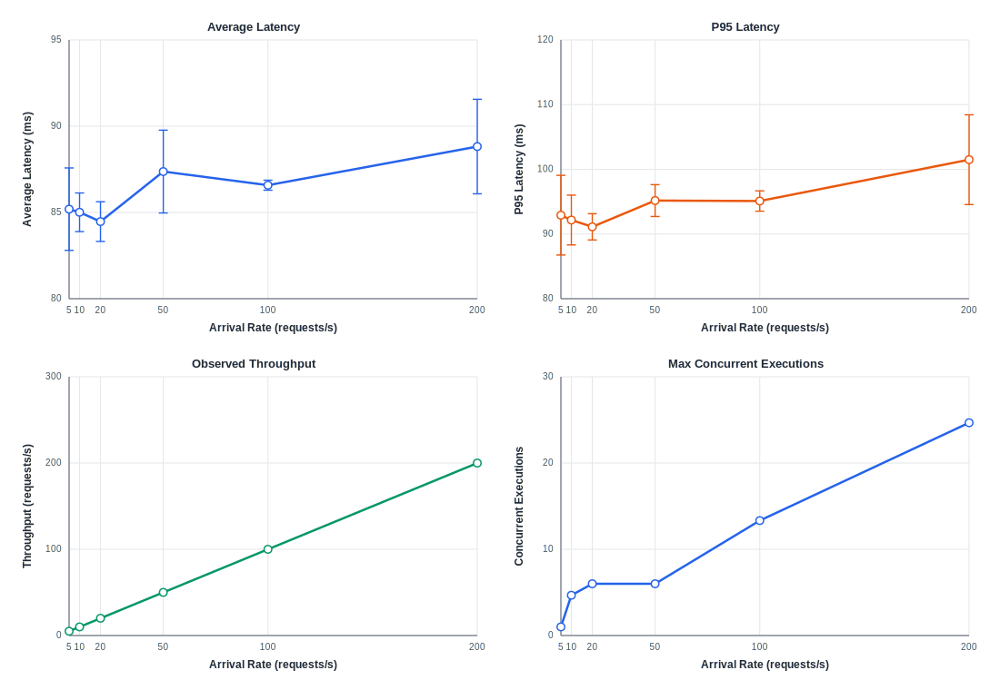
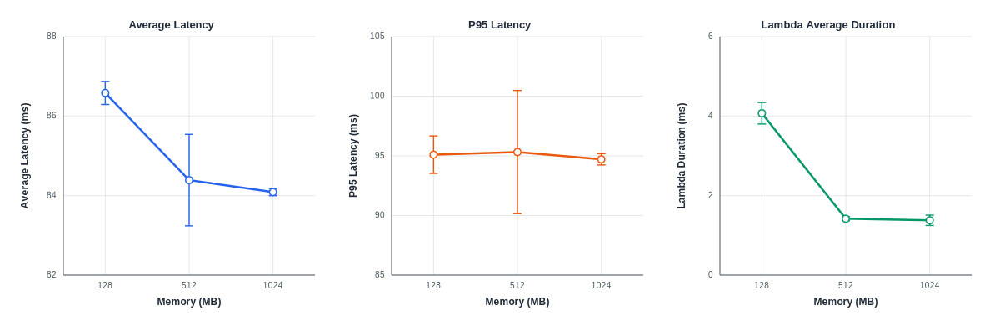
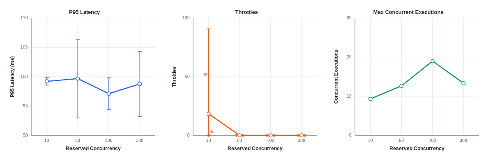
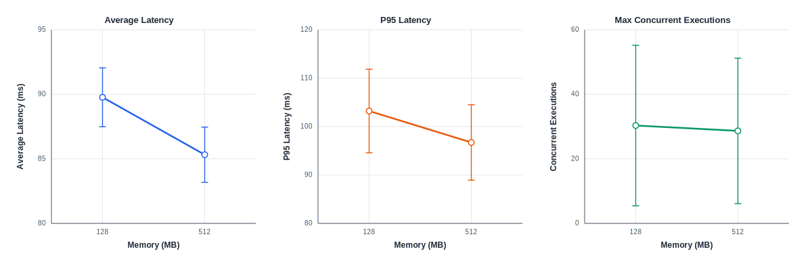
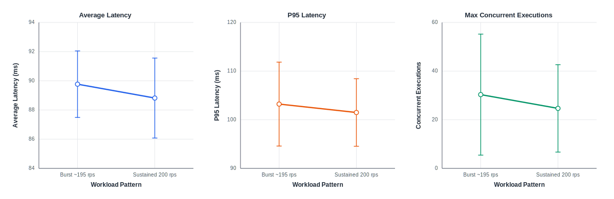

# Performance Evaluation of an AWS Lambda-Based Serverless API Under Sustained, Bursty, and Constrained Concurrency Workloads

**Course:** SENG 533 Performance Evaluation of Large-Scale Software Systems  
**Date:** March 27, 2026  
**Team:** Saad Sheikh, Yaseen Rashid, Siddhartha Paudel, Arsalan Baig, Saim Khalid, Hashir Naved  
**Public Repository:** [https://github.com/SaadTheBaad/seng533-group15-lambda-performance](https://github.com/SaadTheBaad/seng533-group15-lambda-performance)

## Abstract

Serverless platforms promise elastic scaling and reduced operational burden, but their performance under realistic workloads remains difficult to reason about. This report evaluates an AWS Lambda-based HTTP API deployed behind Amazon API Gateway and observed through Amazon CloudWatch. The study focuses on four practical questions: how arrival rate affects latency and concurrency, how effectively Lambda autoscaling sustains throughput, how memory allocation changes function execution time versus end-to-end response time, and how reserved concurrency limits and bursty traffic alter behavior. We analyze 14 experimental configurations and 42 total runs, using three repetitions per configuration and reporting descriptive 95% confidence intervals based on Student's t-distribution with two degrees of freedom. The results show that Lambda sustained offered load closely up to 200 requests/s without throughput collapse, while tail latency increased from 92.91 +/- 6.16 ms at 5 requests/s to 101.49 +/- 6.94 ms at 200 requests/s. Increasing memory from 128 MB to 1024 MB reduced mean Lambda execution time from 4.07 +/- 0.27 ms to 1.38 +/- 0.13 ms, but average end-to-end latency changed only modestly. Reserved concurrency of 10 introduced throttling, whereas 50 or more eliminated it with little throughput change. Burst traffic exhibited worse latency and higher concurrency than a comparable sustained high-load case.

## 1. Introduction

Serverless computing is attractive because it abstracts server management, scales on demand, and bills users only for consumed execution time [5], [6]. In practice, however, these benefits are accompanied by uncertainty in latency, cold-start behavior, and scaling under changing demand. For API-driven systems, that uncertainty matters because user experience depends more on end-to-end behavior than on the nominal simplicity of the deployment model.

AWS Lambda is a widely used function-as-a-service platform, and AWS documents its automatic scaling model, execution-environment lifecycle, memory scaling, and function-level concurrency controls in detail [1]-[4]. Existing research has also shown that serverless platforms can display meaningful variability in cold-start latency, resource contention, and infrastructure behavior that is opaque to users [5]-[9]. Prior measurement work has studied large-scale platform internals and production traces [7], [8], while broader systems papers have emphasized both the appeal and the unresolved limitations of the serverless model [5], [6], [9].

This project addresses a narrower but still practically useful gap: a controlled, end-to-end performance evaluation of a simple AWS Lambda web API across sustained load, bursty load, memory scaling, and reserved concurrency constraints. By intentionally using a lightweight function, the study reduces application-level confounding and isolates infrastructure-visible behavior more clearly.

The report answers four performance-evaluation questions:

1. How does increasing arrival rate affect end-to-end latency, throughput, and concurrency?
2. How effectively does Lambda autoscale under sustained load?
3. How does memory allocation affect Lambda execution time versus end-to-end response time?
4. How do reserved concurrency limits and bursty workloads change observed behavior?

The main findings are as follows. First, throughput tracked offered load closely up to 200 requests/s under unreserved concurrency. Second, average latency remained relatively stable, but P95 latency worsened at the highest sustained load. Third, higher memory reduced Lambda execution duration sharply but produced only small changes in end-to-end latency, implying that non-handler overhead dominates this workload. Fourth, reserved concurrency of 10 caused throttling, while 50 or more removed it without materially changing throughput.

## 2. Background and Related Work

AWS Lambda executes functions inside managed execution environments and automatically increases the number of concurrent environments as in-flight requests grow [1]. AWS also exposes controls that materially affect performance analysis. Reserved concurrency caps and guarantees capacity for a function, acting as both a lower and upper bound on concurrent scale [2]. Lambda memory settings also matter because AWS allocates proportional CPU resources as memory increases [4]. In addition, the execution environment lifecycle includes an initialization phase, which is one of the core contributors to cold-start overhead [3].

These platform characteristics motivate performance evaluation beyond simple average-response-time reporting. Baldini et al. describe serverless computing as an important cloud-programming abstraction but also identify open problems in predictability and systems behavior [5]. Jonas et al. argue that serverless is a major programming shift, while also emphasizing current performance limitations and research opportunities [6]. Wang et al. provide a landmark measurement study of commercial serverless platforms and show that scaling and cold-start behavior are not transparent from the client perspective [7]. Shahrad et al. analyze production FaaS traces and demonstrate that workload diversity and infrequency complicate resource management and cold-start mitigation [8]. Hellerstein et al. further argue that serverless abstractions remain operationally compelling, but still leave important systems-level limitations unresolved [9].

Relative to this literature, the contribution of this report is not a new platform design or provider-scale trace analysis. Instead, it is a controlled end-to-end case study of AWS Lambda under multiple workload and configuration factors, using the same application logic across all experiments and reporting comparable metrics from both the client side and the platform side.

## 3. Methodology

### 3.1 System Under Study

The evaluated system is a simple HTTP API implemented with AWS Lambda and exposed through Amazon API Gateway. The Lambda handler is written in Node.js and performs two lightweight operations: JSON parsing and a fixed-size arithmetic loop. Amazon CloudWatch is used to collect invocation, duration, concurrency, and throttle measurements. No database, storage layer, or downstream microservice is included, so that the results primarily reflect serverless-platform behavior rather than application complexity.

Figure 1 shows the system architecture.

*Figure 1. Experimental architecture. The load generator was intentionally separated from the hosted service to avoid local resource interference.*

### 3.2 Metrics

The main end-to-end metrics were average latency, P95 latency, maximum latency, throughput, and error rate. Platform-side metrics were Lambda invocation count, average and maximum Lambda duration, maximum concurrent executions, and throttles. Cold starts were recorded as an observation field in the dataset and are treated qualitatively in this report.

Throughput was computed as `requests_completed / duration_seconds`.

### 3.3 Experimental Factors and Workloads

Each experimental configuration ran for 10 minutes and was repeated three times. The final dataset contains 14 configurations and 42 total runs. Sustained tests used a constant-arrival-rate workload, while burst tests ramped from 5 requests/s to 200 requests/s over 30 seconds and then held the high-load phase for the remainder of the run.

Table 1 summarizes the experiment matrix.

| Group | Runs | Workload | Factor Levels | Purpose |
| --- | --- | --- | --- | --- |
| A | `run01`-`run06` | Sustained | 5, 10, 20, 50, 100, 200 requests/s; 128 MB; unreserved concurrency | Baseline scaling |
| B | `run05`, `run07`, `run08` | Sustained | 100 requests/s; 128, 512, 1024 MB; unreserved concurrency | Memory sensitivity |
| C | `run09`, `run10` | Burst | Peak about 195 requests/s; 128 and 512 MB; unreserved concurrency | Burst behavior |
| D | `run11`-`run14` | Sustained | 100 requests/s; 128 MB; reserved concurrency 10, 50, 100, 300 | Concurrency constraints |

### 3.4 Experimental Setup and Analysis

The Lambda service was deployed in a single fixed AWS region, and the load generator ran on a separate client machine, documented in the project reports as a MacBook Air M2. This separation is important because shared placement of load generator and service can distort observed results. Data collection combined k6 client-side summaries with CloudWatch monitoring outputs. The repository's `master_results.csv` was used as the source of record for analysis, and the `run11` workload typo (`sustaiined`) was normalized during processing.

Statistical analysis is descriptive rather than inferential. For each configuration, the report uses the sample mean over three repetitions and a 95% confidence interval computed using Student's t-distribution with `df = 2` (`t = 4.303`). Because `n = 3` is small, confidence intervals are used to indicate variability rather than to support strong significance claims.

## 4. Results

Figure 2 summarizes baseline scaling under sustained load at 128 MB with unreserved concurrency.

*Figure 2. Baseline scaling at 128 MB under unreserved concurrency. Error bars indicate descriptive 95% confidence intervals where shown.*

### 4.1 Baseline Scaling Under Sustained Load

The baseline results show that Lambda maintained throughput almost exactly at the offered rate across the full range of tested sustained loads. Mean throughput increased from 5.00 requests/s at 5 requests/s input to 199.95 requests/s at 200 requests/s input, with no meaningful throughput collapse. This indicates that, for this lightweight workload, Lambda scaled sufficiently to preserve service capacity over the tested range.

Latency tells a more nuanced story. Average latency remained relatively stable, moving from 85.19 +/- 2.39 ms at 5 requests/s to 88.82 +/- 2.74 ms at 200 requests/s. In contrast, P95 latency increased from 92.91 +/- 6.16 ms to 101.49 +/- 6.94 ms over the same range. This gap between mean and tail behavior is important: the system remained stable on average, but became less predictable at the upper tail as load increased.

Concurrency growth supports the autoscaling interpretation. Mean maximum concurrent executions rose from 1.00 at 5 requests/s to 24.67 at 200 requests/s. The trend is not perfectly linear because the client-visible concurrency metric is itself variable and depends on timing overlap, but the direction is clear and consistent with AWS's concurrency model [1].

**Takeaway.** Under unreserved sustained load, Lambda preserved throughput and kept average latency stable, but tail latency and concurrent execution counts increased as demand approached the high end of the tested range.

Figure 3 isolates the effect of memory allocation at 100 requests/s.

*Figure 3. Effect of memory allocation on latency and Lambda execution duration at 100 requests/s.*

### 4.2 Memory Sensitivity at 100 Requests/s

The strongest memory-related result is not in end-to-end latency, but in function execution time. Increasing memory from 128 MB to 512 MB reduced mean Lambda duration from 4.07 +/- 0.27 ms to 1.42 +/- 0.05 ms, and increasing memory further to 1024 MB reduced it to 1.38 +/- 0.13 ms. Relative to the 128 MB configuration, the 1024 MB setting reduced mean Lambda execution time by roughly 66%.

End-to-end latency changed much less. Average latency improved from 86.58 +/- 0.29 ms at 128 MB to 84.39 +/- 1.15 ms at 512 MB and 84.09 +/- 0.09 ms at 1024 MB. P95 latency was nearly flat: 95.10 +/- 1.57 ms at 128 MB, 95.32 +/- 5.16 ms at 512 MB, and 94.71 +/- 0.47 ms at 1024 MB.

This contrast suggests that the workload is not dominated by handler compute time. Once the function itself becomes very fast, the remaining latency budget is mostly attributable to other components of the request path, such as API Gateway, Lambda service overhead, network traversal, and runtime-management overhead. In other words, more memory materially accelerates the function, but that does not translate into a proportional end-to-end latency reduction for this application.

**Takeaway.** Memory scaling significantly reduced Lambda execution time, but only modestly improved client-visible latency, implying that the handler was not the dominant contributor to end-to-end delay.

Figure 4 shows the effect of reserved concurrency at 100 requests/s and 128 MB.

*Figure 4. Reserved concurrency behavior at 100 requests/s. The throttles panel overlays raw repetitions on top of mean and confidence interval markers.*

### 4.3 Reserved Concurrency Effects at 100 Requests/s

Reserved concurrency of 10 was the only tested setting that produced non-zero throttling. The three repetitions for this configuration observed raw throttle counts of 52, 0, and 3, yielding a mean of 18.33 and a very wide descriptive confidence interval. Despite that variability, the qualitative result is unambiguous: throttling appears only when the configured limit is low enough to materially constrain scaling.

By contrast, reserved concurrency values of 50, 100, and 300 produced zero observed throttles across all repetitions. Throughput remained effectively unchanged across the entire reserved-concurrency sweep, staying between 99.96 and 99.98 requests/s. P95 latency also remained in a narrow band from 97.11 +/- 2.72 ms to 99.68 +/- 6.70 ms, indicating that higher reserved concurrency did not create a meaningful latency benefit once the service had enough headroom to avoid throttling.

The concurrency panel explains why. With a reserved limit of 10, the mean maximum concurrent execution count was 9.33, very close to the cap. Once the limit increased to 50 or more, the function no longer operated against a tight ceiling, and throttles disappeared. This matches AWS's documented semantics for reserved concurrency as both a guaranteed allocation and an upper bound [2].

**Takeaway.** A reserved concurrency limit of 10 was too restrictive for 100 requests/s and introduced throttling; 50 or more removed that constraint without changing throughput materially.

Figure 5 compares burst workloads at two memory settings, and Figure 6 compares burst and sustained high-load behavior directly.

*Figure 5. Burst workload behavior at approximately 195 requests/s peak.*

*Figure 6. Direct comparison between burst traffic at approximately 195 requests/s and sustained traffic at 200 requests/s, both at 128 MB with unreserved concurrency.*

### 4.4 Burst-Workload Behavior

Burst traffic produced worse latency than sustained traffic at similar high load. At 128 MB, the burst workload yielded 89.77 +/- 2.28 ms average latency and 103.22 +/- 8.63 ms P95 latency, compared with 88.82 +/- 2.74 ms average latency and 101.49 +/- 6.94 ms P95 latency for the sustained 200 requests/s case. The burst workload also exhibited a higher mean maximum concurrency value (30.33 versus 24.67), which is consistent with the idea that rapid demand changes induce more aggressive environment creation.

Memory scaling helped more in the burst case than it did for sustained 100 requests/s. Moving from 128 MB to 512 MB reduced burst average latency from 89.77 +/- 2.28 ms to 85.32 +/- 2.14 ms and reduced burst P95 latency from 103.22 +/- 8.63 ms to 96.72 +/- 7.80 ms. Lambda average duration again dropped sharply, from 5.19 +/- 1.25 ms to 1.57 +/- 0.09 ms.

These results suggest that memory headroom becomes more valuable when the platform is reacting to rapid traffic growth, not just steady-state demand. Still, the burst-versus-sustained comparison should be interpreted carefully because the offered loads are close but not identical (approximately 195 versus 200 requests/s), and the burst pattern introduces time-varying arrival behavior that is not captured by a single scalar rate.

**Takeaway.** Burst traffic imposed a modest but consistent penalty in tail latency and concurrency, and higher memory improved burst performance more clearly than it improved the steady 100 requests/s case.

### 4.5 Cold-Start Observations and Limitations

The cold-start field in the dataset marked a cold start in 34 of the 42 repetitions. However, these observations should be treated as qualitative rather than as a stand-alone statistical result. The dataset does not include trace-level initialization times or request-level timestamps that would support a rigorous cold-start decomposition.

Even so, the data is consistent with cold starts contributing primarily to tail behavior rather than steady-state means. For example, the baseline 5 requests/s run had a mean Lambda duration of 17.03 +/- 66.46 ms, but that estimate is driven by one repetition with a much larger average duration than the others. More generally, maximum latency and maximum Lambda duration vary far more than average latency in several configurations, which is compatible with occasional initialization overhead.

The study therefore supports a cautious conclusion: cold starts were present and visible, but the current instrumentation is insufficient to quantify their isolated contribution with high confidence.

**Takeaway.** Cold starts are observable in the experimental corpus, but the available instrumentation only supports qualitative interpretation, not rigorous cold-start attribution.

### 4.6 Summary Statistics

Table 2 consolidates selected configurations that capture the main patterns in the dataset.

| Configuration | Average latency (ms) | P95 latency (ms) | Throughput (rps) | Notable control metric |
| --- | --- | --- | --- | --- |
| Sustained, 100 rps, 128 MB, unreserved | 86.58 +/- 0.29 | 95.10 +/- 1.57 | 99.98 | 13.33 concurrent executions |
| Sustained, 200 rps, 128 MB, unreserved | 88.82 +/- 2.74 | 101.49 +/- 6.94 | 199.95 | 24.67 concurrent executions |
| Sustained, 100 rps, 512 MB, unreserved | 84.39 +/- 1.15 | 95.32 +/- 5.16 | 99.97 | 1.42 +/- 0.05 ms Lambda duration |
| Sustained, 100 rps, 1024 MB, unreserved | 84.09 +/- 0.09 | 94.71 +/- 0.47 | 99.97 | 1.38 +/- 0.13 ms Lambda duration |
| Sustained, 100 rps, 128 MB, reserved = 10 | 88.42 +/- 1.24 | 99.21 +/- 0.64 | 99.98 | 18.33 mean throttles |
| Sustained, 100 rps, 128 MB, reserved = 50 | 88.40 +/- 1.94 | 99.68 +/- 6.70 | 99.98 | 0 throttles |
| Burst, ~195 rps peak, 128 MB | 89.77 +/- 2.28 | 103.22 +/- 8.63 | 195.12 | 30.33 concurrent executions |
| Burst, ~195 rps peak, 512 MB | 85.32 +/- 2.14 | 96.72 +/- 7.80 | 195.12 | 28.67 concurrent executions |

## 5. Conclusions and Future Work

This report evaluated a deliberately simple AWS Lambda-based API under sustained load, burst traffic, memory scaling, and reserved concurrency constraints. The main conclusion is that Lambda scaled effectively for this workload over the tested demand range: throughput tracked offered load, and average latency stayed relatively stable. The more important performance changes appeared in tail latency and concurrency behavior. As demand increased, P95 latency rose even when throughput remained stable, indicating that average latency alone would understate user-visible variability.

The second major conclusion is that memory allocation primarily improved function execution time rather than end-to-end response time. For this API, raising memory substantially reduced Lambda duration, but only modestly improved client-visible latency. This suggests that once handler logic is lightweight, further gains require either lower platform overhead or a different application design, not simply more Lambda memory.

Third, the reserved-concurrency results show that function-level concurrency controls matter mostly when they are set too low. A limit of 10 constrained execution and produced throttles, whereas 50 or more provided enough room for the 100 requests/s workload. Finally, burst traffic imposed a measurable penalty compared with a comparable sustained high-load case, particularly in tail latency and concurrent-execution demand.

The main limitations of the study are the small number of repetitions per configuration, the absence of request-level traces for cold-start isolation, and incomplete environmental metadata in the repository for some deployment details such as the exact AWS region. Future work should address these limits by collecting per-request traces, separating cold and warm invocations explicitly, extending burst experiments to more intensity levels, and incorporating cost analysis so that performance improvements can be interpreted jointly with billing impact.

## References

[1] Amazon Web Services, "Understanding Lambda function scaling," AWS Lambda Developer Guide. [Online]. https://docs.aws.amazon.com/lambda/latest/dg/lambda-concurrency 

[2] Amazon Web Services, "Configuring reserved concurrency for a function," AWS Lambda Developer Guide. [Online]. https://docs.aws.amazon.com/lambda/latest/dg/configuration-concurrency

[3] Amazon Web Services, "Lambda execution environment lifecycle," AWS Lambda Developer Guide. [Online]. https://docs.aws.amazon.com/lambda/latest/dg/runtimes-extensions-api

[4] Amazon Web Services, "Configuring Lambda function memory," AWS Lambda Developer Guide. [Online]. https://docs.aws.amazon.com/lambda/latest/dg/configuration-memory

[5] I. Baldini, P. Castro, K. Chang, P. Cheng, S. Fink, V. Ishakian, N. Mitchell, V. Muthusamy, R. Rabbah, A. Slominski, and P. Suter, "Serverless Computing: Current Trends and 
Open Problems," in Research Advances in Cloud Computing, Singapore: Springer, 2017. [Online]. https://doi.org/10.1007/978-981-10-5026-8_1

[6] E. Jonas, J. Schleier-Smith, V. Sreekanti, C.-C. Tsai, A. Khandelwal, Q. Pu, V. Shankar, J. M. Carreira, K. Krauth, N. Yadwadkar, J. Gonzalez, R. A. Popa, I. Stoica, and D. A. Patterson, "Cloud Programming Simplified: A Berkeley View on Serverless Computing," EECS Department, University of California, Berkeley, Tech. Rep. UCB/EECS-2019-3, 2019. 
[Online]. https://www2.eecs.berkeley.edu/Pubs/TechRpts/2019/EECS-2019-3.html

[7] L. Wang, M. Li, Y. Zhang, T. Ristenpart, and M. Swift, "Peeking Behind the Curtains of Serverless Platforms," in 2018 USENIX Annual Technical Conference (USENIX ATC 18), 2018, pp. 133-146. [Online]. https://www.usenix.org/conference/atc18/presentation/wang-liang

[8] M. Shahrad, R. Fonseca, I. Goiri, G. I. Chaudhry, P. Batum, J. Cooke, E. Laureano, C. Tresness, M. Russinovich, and R. Bianchini, "Serverless in the Wild: Characterizing and Optimizing the Serverless Workload at a Large Cloud Provider," in 2020 USENIX Annual Technical Conference (USENIX ATC 20), 2020. [Online]. Available: https://www.usenix.org/conference/atc20/presentation/shahrad

[9] J. M. Hellerstein, J. M. Faleiro, J. E. Gonzalez, J. Schleier-Smith, A. Sreekanti, A. Tumanov, and C. Wu, "Serverless Computing: One Step Forward, Two Steps Back," in Conference on Innovative Data Systems Research (CIDR), 2019. [Online]. Available: http://cidrdb.org/cidr2019/papers/p119-hellerstein-cidr19.pdf

